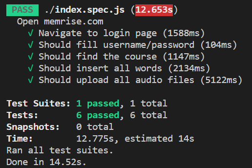
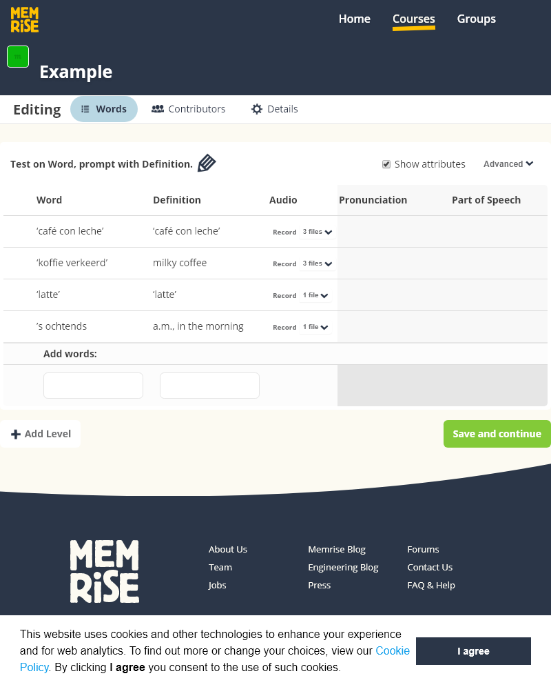

# MemriseUpload 

Jest + Puppeteer => Utility script for uploading flash cards (with audio) files to Memrise.com.

# This is an old repo, it won't get updated and not sure if it still works

---

## Installation:

1. Download and install [NodeJS](https://nodejs.org/en/download/) 10.x or higher on your Machine.
2. Install [Yarn package manager](https://classic.yarnpkg.com/en/docs/install).
3. Download source or clone it.
3. Run `yarn install` in terminal/console. (In project directory)

## How to run:

There is a `settings.json` file, modify it and enter your credentials and course data.

```
{
    "username": "PUT YOUR USERNME",
    "password": "PUT YOUR PASSWORD",
    "memriseBaseUrl": "https://www.memrise.com",
    "courseName": "THE COURSE NAME",
    "headless": true,
    "columnMaps": {
        "column1": "dutch",
        "column2": "english"
    }
}
```

* `courseName` should be equal to the name of the course on Memrise you just created. 💡 It's case sensetive.
* The script opens chromium in background, and fills the data. If you are curios how it does improt process, just set `headless` to true.
* `columnMaps` will use for reading your course data.

## Where to put course file?
Courses can saved inside `courses` directory. Each course should have a `json` file. The name of the file should be equal to the `courseName`. If your course have some voices/audios, put them inside a folder named equal to the `courseName`. (There is an example inside the course.)

This is the strcture of a course data:

```
[
  {
    "english": "",
    "dutch": "‘café con leche’",
    "audio": "0.mp3",
    "type": "for e.g. verb!"
  },
  {
    "english": "milky coffee",
    "dutch": "‘koffie verkeerd’",
    "audio": "1.mp3",
  },
  {
    "english": "",
    "dutch": "‘latte’",
    "audio": "2.mp3",
  },
  {
    "english": "a.m., in the morning",
    "dutch": "’s ochtends",
    "audio": "3.mp3",
  }
]
```

For e.g. in the file above, `english` and `dutch` will be mapped to `column2` and `column1`. If you declare a `type` property for each word, this column will be use as an attribute like `part of speech` in Memrise.

💡 After you created a brand new course on Memrise.com, and you'd like to upload audios: Please make sure: You add a new column `Audio`

At the end of running, you can see the results in the terminal/console:



You can also find an screenshot next to the script. It will be named like `CourseName-result.png`.



